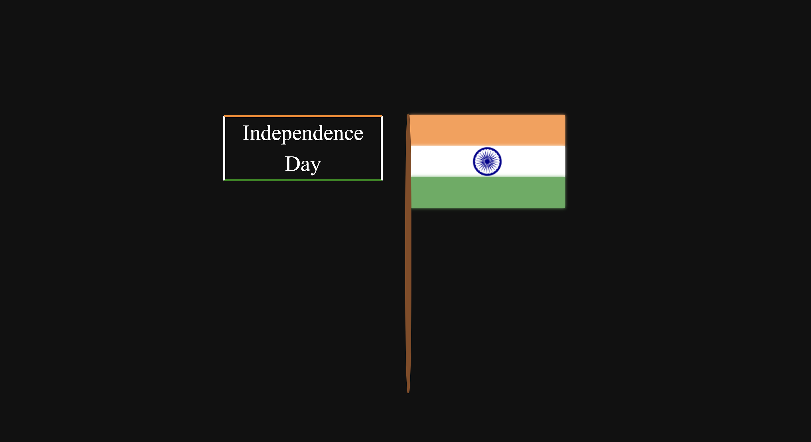

# Happy Independance Day wish Using HTML , CSS & JS

This repository contains an animated Indian Falg  created using HTML and CSS. The form features smooth animations and a modern design. Perfect for web developers looking projects.

# Tutorial is available on youtube channel 
click on the link to see :- ([Open in Youtube]())

# Screenshot
Here we have project screenshot :

Flag:

# Requirements

A web browser that supports HTML, CSS, and JavaScript

# SortedCoding
We create a project each 4 days with voting on our <a href="https://youtube.com/@snakecoding_12" target="_blank">Youtube</a> channel.
You can vote for upcoming projects on our channel **community** page :wink:

# Author

SortedCoding

